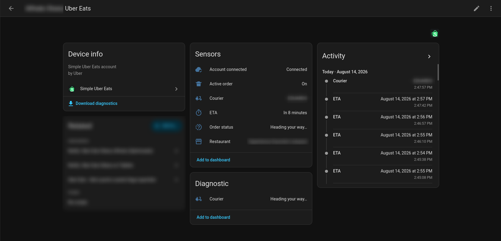
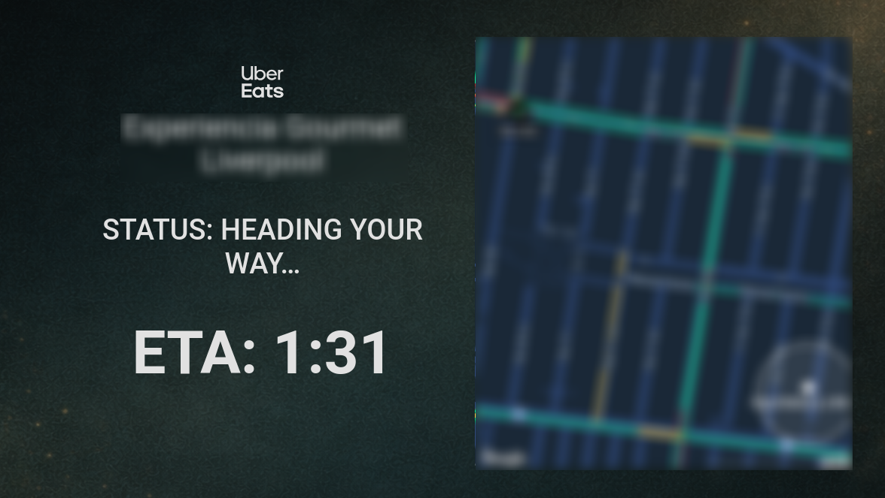

# Simple Uber Eats

[](https://github.com/hacs/integration)
[](https://github.com/alfredolvera/simple-uber-eats/releases)
[](https://github.com/alfredolvera/simple-uber-eats)

A lightweight Home Assistant custom integration for tracking active Uber Eats orders using native Home Assistant entities.



## Overview

Simple Uber Eats is designed around Home Assistant's native entity model. Current order data is exposed through standard sensors, binary sensors, and a device tracker so it can be used with normal dashboards and automations.

This integration is unofficial and uses Uber's web endpoints rather than a public supported API.

## Features

- Account connectivity monitoring
- Active-order detection
- Uber's visible order status text, with a deterministic fallback
- Authoritative timezone-aware ETA timestamp without per-second state writes
- Restaurant coordinates for direct use in the native Map card
- Restaurant and courier entities with clean display names
- Native courier `device_tracker`
- Smooth courier movement at approximately 1 Hz using buffered interpolation
- No extra Uber requests for smooth movement
- Adaptive API polling:
  - 60 seconds with no active order
  - 15 seconds with an active order but no valid courier
  - 10 seconds with an active order and valid courier
- Bounded HTTP 429 backoff: 60, 120, then 300 seconds
- Session/cookie rotation
- Reconfigure and reauthentication flows
- Sanitized downloadable diagnostics
- Multiple independent accounts/config entries

## Entities

| Name | Platform | Purpose |
| --- | --- | --- |
| Account connected | `binary_sensor` | Distinguishes a successful connection, confirmed authentication failure, and temporary unavailability |
| Active order | `binary_sensor` | Indicates whether Uber currently reports an active order |
| Order status | `sensor` | Uber's visible status text for the primary active order |
| ETA | `sensor` | Estimated arrival timestamp reported by Uber |
| Restaurant | `sensor` | Restaurant name with active latitude/longitude attributes |
| Courier | `sensor` | Assigned courier name |
| Courier | `device_tracker` | Latest displayed courier position for Home Assistant maps |

When Uber supplies visible status wording, the integration preserves that text,
including its casing and punctuation. Examples include `Picking up your
order…`, `Heading your way…`, and `Oops, finding another delivery person...`.
If visible wording is absent, the deterministic fallback values are:

- `preparing`
- `picked up`
- `en route`
- `arriving`
- `delivered`
- `unknown`

Completion is authoritative when Uber no longer returns an active order.

The ETA state is Uber's timezone-aware estimated arrival timestamp. It updates
only when the coordinator receives new order data; the integration does not
run a per-second ETA timer or publish per-second ETA state changes. The same
authoritative value remains available in the `arrival_time` attribute.
Dashboards can calculate a local countdown from this timestamp if desired.

Fresh installations display the retained entities as **Restaurant**,
**Courier**, and **ETA**. Their released unique IDs remain stable.

For accounts with multiple simultaneous orders, the entities represent the first active order returned by Uber. Each config entry has its own independent entity set.

## Optional real-time ETA countdown

Simple Uber Eats exposes ETA as a stable Home Assistant timestamp, for example
`sensor.YOUR_ACCOUNT_uber_eats_eta`. The integration itself does not count down
every second. If you want a live minutes-and-seconds display, install
[`custom:button-card`](https://github.com/custom-cards/button-card) and let the
dashboard calculate the countdown locally.



Replace `sensor.YOUR_ACCOUNT_uber_eats_eta` with the ETA entity created for your
account:

```yaml
type: custom:button-card
entity: sensor.YOUR_ACCOUNT_uber_eats_eta
show_icon: false
show_name: false
show_state: false
show_label: true
update_timer: 1000

label: |
  [[[
    const etaSensor =
      states['sensor.YOUR_ACCOUNT_uber_eats_eta'];

    if (!etaSensor) {
      return 'No order';
    }

    const etaStr = etaSensor.state;

    if (
      !etaStr ||
      etaStr === 'unknown' ||
      etaStr === 'unavailable'
    ) {
      return 'No order';
    }

    const target = new Date(etaStr);
    const now = new Date();

    if (isNaN(target.getTime())) {
      return 'ETA: --:--';
    }

    const diff = Math.floor((target - now) / 1000);

    if (diff <= 0) {
      return 'ETA: Arriving';
    }

    const totalMinutes = Math.floor(diff / 60);
    const seconds = diff % 60;

    return `ETA: ${totalMinutes}:${String(seconds).padStart(2, '0')}`;
  ]]]

styles:
  card:
    - background: none
    - box-shadow: none
    - border: none
    - padding: 0px
  label:
    - font-size: 80px
    - font-weight: 600
```

`update_timer: 1000` refreshes this card in the browser approximately once per
second. It does not make Simple Uber Eats emit a Home Assistant
`state_changed` event every second, and it does not add Uber API requests.

## Smooth courier tracking

Courier movement uses this local pipeline:

```text
Uber API
  -> courier_path_points
  -> local 12-second playback buffer
  -> timestamp-based interpolation
  -> device_tracker updates approximately once per second
```

Uber is **not** polled once per second. The coordinator fetches at the adaptive intervals above, and the tracker locally interpolates only between real, timestamped Uber telemetry points. It never dead-reckons beyond the newest real point. If buffered data runs out, the tracker freezes safely and resumes when newer telemetry arrives.

Before a courier is assigned, the tracker remains idle without inventing a location.

## Standard Home Assistant Map card

Use the native courier tracker directly in Home Assistant's standard Map card:

```yaml
type: map
entities:
  - entity: device_tracker.example
    label_mode: icon
```

`label_mode: icon` displays the entity icon instead of a text or initial marker. Replace `device_tracker.example` with the courier tracker created for your account.

The Restaurant sensor can also be added directly to a Map card while an order
is active because it exposes validated `latitude` and `longitude` attributes.
Those attributes are removed when the order completes.

## Installation

Simple Uber Eats 3.0 requires Home Assistant 2026.8 or newer.

### HACS custom repository

[](https://my.home-assistant.io/redirect/hacs_repository/?owner=alfredolvera&repository=simple-uber-eats&category=integration)

1. Open HACS in Home Assistant.
2. Select **Integrations** and open the menu in the upper-right corner.
3. Select **Custom repositories**.
4. Add `https://github.com/alfredolvera/simple-uber-eats` as an **Integration** repository.
5. Search for **Simple Uber Eats** and install it.
6. Restart Home Assistant.
7. Go to **Settings → Devices & services → Add integration** and search for **Simple Uber Eats**.

### Manual installation

1. Download the source from [alfredolvera/simple-uber-eats](https://github.com/alfredolvera/simple-uber-eats).
2. Copy `custom_components/simple_uber_eats/` into Home Assistant's `/config/custom_components/` directory.
3. Restart Home Assistant.
4. Add **Simple Uber Eats** from **Settings → Devices & services**.

## Authentication

Simple Uber Eats connects through an Uber Eats browser session that is already
signed in. The recommended method is to copy one browser request as cURL and
paste it into Home Assistant. You do not need to understand the request or
manually find individual cookies.

### Recommended setup: Copy as cURL

1. **Open a supported desktop browser.** Firefox, Chrome, Chromium, Edge, and
   Brave provide a direct Copy as cURL command. Safari users can use the
   alternative described below.
2. **Open Developer Tools.** Press **F12** where supported, or press
   **Ctrl+Shift+I** on Windows/Linux. On macOS, press **Command+Option+I**.
   You can also open Developer Tools from the browser's main menu.
3. **Open the Network tab.** Network shows requests made by the webpage. You
   do not need to understand or modify anything shown there.
4. **Keep Developer Tools open and visit
   [https://www.ubereats.com/](https://www.ubereats.com/).**
5. **Sign in normally if needed.** Enter your Uber password only on Uber's own
   website and complete any email OTP, SMS code, or two-factor verification
   only there. Simple Uber Eats never asks for your password or verification
   code.
6. **Reload the Uber Eats page once** while Network is open so the browser
   records a fresh set of requests.
7. **Use the Network filter box and search for `getActiveOrdersV1`.** Look for
   a request whose name contains that text. If it does not appear, clear the
   filter, reload, and try `getUserV1` as a fallback.
8. **Right-click the request.**
9. **Choose Copy → Copy as cURL.** Menu wording can differ slightly by browser;
   choose the Copy as cURL option from the request's context menu.
10. **Return to Home Assistant.**
11. **Open Settings → Devices & services → Add integration** and search for
    **Simple Uber Eats**.
12. **Paste the entire copied cURL into the Uber Eats session field.** Do not
    edit it, remove lines, or try to extract the Cookie header yourself. Simple
    Uber Eats locates the required session data automatically.
13. **Submit the form.** Parsing happens locally in Home Assistant. The
    integration extracts only `sid` and `uev2.id.session`, immediately discards
    all other request headers, cookies, URLs, and body data, and validates the
    two credentials directly with Uber Eats.
14. **Confirm setup completed.** Home Assistant creates a Simple Uber Eats
    device named for the connected account and adds its connectivity,
    active-order, status, ETA, restaurant, courier, and tracker entities.

### Browser-specific instructions

#### Firefox

1. Open Firefox.
2. Press **F12** (or **Ctrl+Shift+I**; on macOS,
   **Command+Option+I**).
3. Click **Network**.
4. Go to [ubereats.com](https://www.ubereats.com/).
5. Sign in to Uber Eats normally.
6. Reload the page if requests are not already visible.
7. Filter for `getActiveOrdersV1`.
8. Right-click the matching request.
9. Choose **Copy → Copy as cURL**.
10. Paste the entire result into the Home Assistant **Uber Eats session**
    field.

#### Chrome, Chromium, Edge, and Brave

1. Open the browser and press **F12** or **Ctrl+Shift+I** (on macOS,
   **Command+Option+I**).
2. Select **Network**.
3. Open [ubereats.com](https://www.ubereats.com/), sign in, and reload once.
4. Filter for `getActiveOrdersV1`.
5. Right-click the matching request.
6. Choose **Copy → Copy as cURL**. Some versions offer variants such as
   **Copy as cURL (bash)**; that format is accepted.
7. Paste the entire result into the Home Assistant **Uber Eats session**
   field.

#### Safari on macOS

Safari's available copy commands vary by version. If the Develop menu is not
visible, open **Safari → Settings → Advanced** and enable **Show features for
web developers**. Then choose **Develop → Show Web Inspector**, open
**Network**, reload Uber Eats, and select `getActiveOrdersV1`.

If the request context menu offers **Copy as cURL**, paste that complete result.
Otherwise, use **Copy Request Headers** if available, or copy the complete
`Cookie:` request-header line. All three formats are accepted by the same Home
Assistant field.

### Advanced alternative inputs

Copy as cURL is the easiest and recommended method. The **Uber Eats session**
field also accepts these fallback formats:

- a copied request-header block
- a complete `Cookie:` header line
- a raw cookie string

The input must contain both required values. This example is deliberately fake:

```text
sid=QA.EXAMPLE; uev2.id.session=00000000-0000-0000-0000-000000000000
```

Regardless of input format, only those two values are retained and sent in the
canonical minimum Cookie header. Response rotation of either value remains
supported.

### Session privacy and security

A copied browser request is sensitive. It can contain active session
credentials, location information, browser or device identifiers, and other
cookies. Treat it like a password:

- never post it in a GitHub issue
- never paste it into Discord, forums, or public chats
- never send it to another person
- never include it in screenshots or logs

The parser runs locally inside Home Assistant. Simple Uber Eats retains only
`sid` and `uev2.id.session`; every other copied header, cookie, URL, and body
value is discarded. Your Uber password, email OTP, SMS code, and two-factor
authentication code are never handled by the integration.

### Authentication troubleshooting

- **No `getActiveOrdersV1` request appears:** Make sure Network was open before
  reloading, reload `ubereats.com`, and confirm you are signed in. If necessary,
  clear the filter and try `getUserV1`.
- **The Network panel is empty:** Leave Developer Tools open and reload the
  webpage. Confirm the Network recording control is enabled.
- **The filter hides everything:** Clear the filter, reload, confirm requests
  appear, and then search again.
- **The copied request is rejected:** Copy it again without manually modifying
  it. Confirm the request came from `www.ubereats.com` and contains a Cookie
  request header.
- **The browser menu differs:** Open the request's context menu and look for
  **Copy as cURL** or **Copy Request Headers**. The complete `Cookie:` line is
  also accepted as a fallback.
- **The session expired:** Sign in to Uber Eats again, repeat Copy as cURL, and
  use **Reconfigure** or the Home Assistant reauthentication prompt to paste
  the fresh request.
- **Uber Eats is temporarily unavailable:** Wait and submit again. A timeout,
  rate limit, or server problem is reported separately from rejected
  credentials.

Use **Reconfigure** on the config entry to replace credentials proactively.
When the integration confirms that authentication has expired, Home Assistant
starts its reauthentication flow and asks for a fresh Uber Eats session.

## Troubleshooting

- **Account connected is unavailable:** Home Assistant has not received a conclusive response, or a temporary network, rate-limit, or server problem occurred. This is not the same as invalid credentials.
- **Account connected is off:** Authentication has been conclusively rejected. Complete the reauthentication flow with a fresh copied Uber Eats request.
- **Courier tracker is idle:** An order may not yet have an assigned courier or usable courier telemetry.
- **Courier marker stops moving:** The tracker does not extrapolate. It freezes when real telemetry runs out and resumes when new real points arrive.
- **ETA is unavailable:** Uber has not supplied a valid ETA, or the reported time falls outside the bounded plausible delivery window. The entity updates when newer coordinator data arrives.
- **More detail is needed:** Open the integration's config entry in **Settings → Devices & services**, select the menu, and download diagnostics. The diagnostic payload includes sanitized polling and tracking telemetry without authentication secrets or raw courier coordinates.

## Privacy and security

- Only `sid` and `uev2.id.session` are stored locally in the Home Assistant config entry and sent to Uber's endpoints as the minimum Cookie header.
- Downloadable diagnostics omit cookies, authentication headers, session identifiers, names, addresses, and raw courier coordinates.
- Smooth playback remains local after Uber telemetry has been received and creates no extra Uber requests.
- This project is unofficial and is not affiliated with, endorsed by, or supported by Uber.

## Development

Simple Uber Eats 3.0 is maintained by **alfredolvera**.

The 3.0 implementation was developed with **OpenAI Codex**, which performed code implementation and refactoring under human direction, review, and live testing.

Architecture decisions, requirements, testing against real Uber Eats orders, and release decisions were directed and validated by alfredolvera.

## Credits / History

This project originated from [zodyking's Uber Eats order tracker](https://github.com/zodyking/uber-eats-order-tracker). [Jwsoat](https://github.com/Jwsoat) later maintained and improved the integration, including important authentication and session work.

The current project is maintained by [alfredolvera](https://github.com/alfredolvera). Version 3.0 is an independently reimplemented native-entity architecture with adaptive polling, sanitized diagnostics, and smooth native courier tracking. See [PROVENANCE.md](PROVENANCE.md) for the concise release-tree provenance statement.

## License

Simple Uber Eats 3.x is available under the [MIT License](LICENSE).

## Maintainer

Maintained by [alfredolvera](https://github.com/alfredolvera).
